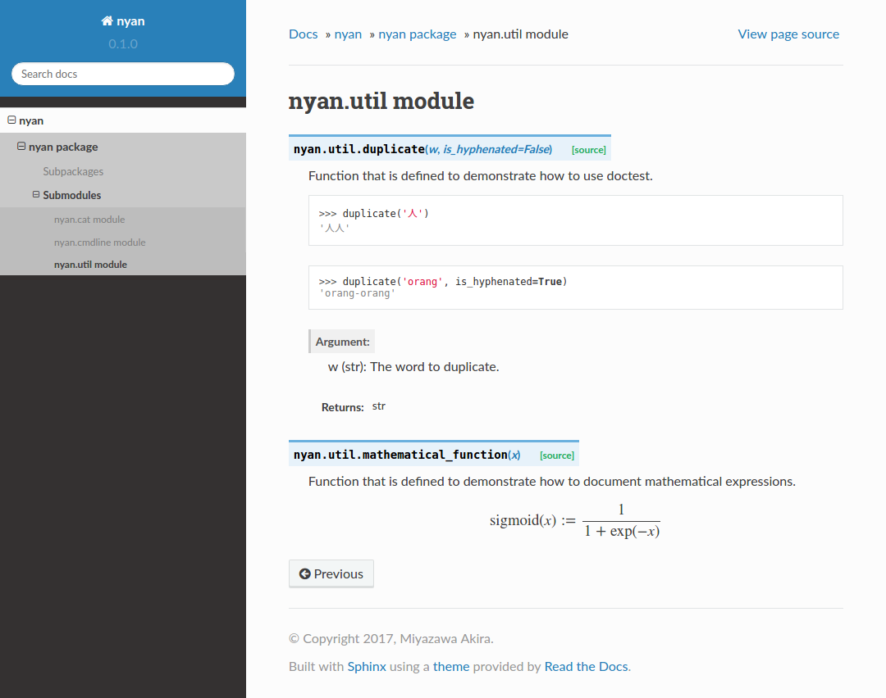

python-project-template
=======================

Template for Python projects.
The sample project **nyan** is assumed to be released as a CLI tool as well as a library.

Requirements
------------

* Python 3.6+

Usage
-----

1. Use this as a CLI tool.

   .. code-block:: bash

      python -m nyan \
          --name Chomusuke \
          --breed "Russian Blue" \
          --sex male
      # or if you have installed the program using `pip`,
      nyan \
          --name Chomusuke \
          --breed "Russian Blue" \
          --sex male

   Then, you will get the following message.

   .. code-block::

      This is my cat, Chomusuke.
      He is a Russian Blue.

2. Import the project as a library as below.

   .. code-block:: python

      from nyan import Cat

      cat = Cat(name="Artemis",
                breed="Russian Blue",
                sex=Sexes.FEMALE)
      print(cat.praise())

Installation using pip
----------------------

.. code-block:: bash

   git clone https://github.com/pecorarista/python-project-template.git
   cd nyan
   pip install .

Coding Style
------------

Follow `PEP 8 <https://www.python.org/dev/peps/pep-0008/>`_.
Run `autopep8 <https://pypi.python.org/pypi/autopep8>`_,
or use a plugin for your editor that checks if your code follows PEP 8.

Test
----

You can test the source code by :code:`make test`.
For detail information, refer to the official documents,

* `unittest <https://docs.python.org/3/library/unittest.html>`_.
* `doctest <https://docs.python.org/3/library/doctest.html>`_.

unittest and doctest can be integrated.
Please take a look at `<tests/test_util.py>`_.

Document
--------

Write docstring for public functions.
Follow the format of `Sphinx <http://www.sphinx-doc.org/en/stable/>`_.
There are several major styles in writing docstring for Sphinx.
You can see an example `here (Google Style Python Docstrings) <http://www.sphinx-doc.org/en/stable/ext/example_google.html>`_.

First edit :code:`author`, :code:`project`, and :code:`version` in `<Makefile>`_.
Then run :code:`make doc`.
It automatically configures Sphinx and creates some files under `<docs>`_.
You can find some examples in `<docs-example>`_.

